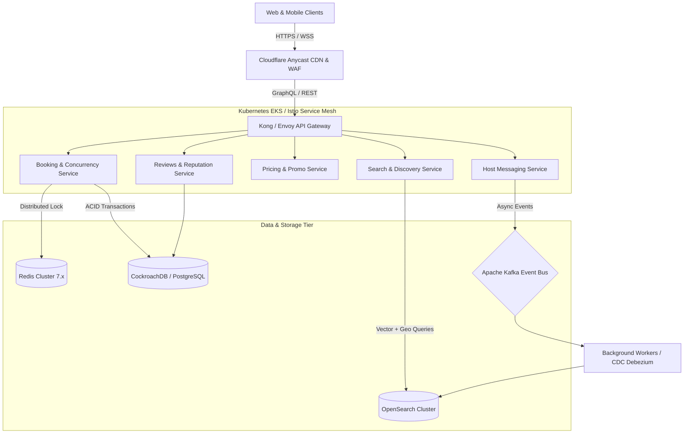

# Vacation-Rental Marketplace: Production-Scale Architecture

This document outlines the high-level architecture, scalability strategy, concurrency handling, search design, and deployment infrastructure for a production-scale vacation rental platform (Airbnb scale: 100M+ Monthly Active Users, millions of concurrent listing views, and sub-second booking guarantees).

---

## 1. High-Level Architecture Overview

The platform uses a **Cloud-Native, Event-Driven Microservices Architecture** deployed across multiple AWS/GCP regions with an anycast Global Edge CDN.

---

## 2. Core Subsystems & Scaling Strategy

### A. Client Tier & Edge Network
- **Edge CDN (Cloudflare Enterprise)**: Caches static Next.js/React SSR chunks, WebP/AVIF images, and metadata with `stale-while-revalidate` caching policies.
- **DDoS & Bot Protection**: Rate limiting with token bucket algorithms, Web Application Firewall (WAF) blocking credential stuffing and scraping attacks.
- **Client Application**: React 18 + Vite / Next.js with optimistic state updates for immediate user feedback on wishlists, reviews, and date selections.

### B. Ingress & API Gateway Tier
- **Kong / Envoy Gateway**: Centralized JWT token validation, mTLS routing, SSL termination, and distributed circuit breaking.
- **GraphQL Federation (Apollo Router)**: Composable subgraph architecture aggregating listing details, real-time availability, host profiles, and reviews in a single round-trip query.

### C. Booking Concurrency & Double-Booking Prevention
One of the hardest challenges in a rental marketplace is **guaranteeing no double bookings** when hundreds of users simultaneously attempt to reserve the same dates for a property.
1. **Distributed Locks (Redis Redlock Algorithm)**:
   - When a user clicks "Reserve", a distributed lock `lock:listing:{id}:dates:{range}` is acquired in Redis with an auto-expiring TTL (10 minutes).
2. **Database Isolation**:
   - CockroachDB / PostgreSQL with `SERIALIZABLE` transaction isolation level.
   - Exclusion constraints (`EXCLUDE USING gist (listing_id WITH =, date_range WITH &&)`).
3. **Two-Phase Commit / Saga Pattern**:
   - Orchestrated Saga for Payment Authorization $\rightarrow$ Inventory Confirmation $\rightarrow$ Host Notification $\rightarrow$ Receipt Generation. If payment fails, compensation transactions immediately release the locked calendar dates.

### D. Search & Geo-Spatial Discovery Engine
- **Uber H3 Hexagonal Hierarchical Spatial Indexing**: Maps geographic coordinates (Candolim, Goa) into compact integer cell indices, allowing instant range querying across millions of listings without expensive polygon joins.
- **OpenSearch Multi-Modal Search**: Combines full-text semantic search (e.g. "jacuzzi, quiet beach Candolim") with real-time numeric filters (price, rating, bedrooms).
- **Change Data Capture (CDC)**: Debezium captures database row mutations and streams updates via Apache Kafka to OpenSearch in $<50\text{ms}$.

### E. Data Persistence & Caching Hierarchy
| Layer | Technology | Purpose | Latency |
| :--- | :--- | :--- | :--- |
| **L1 In-Memory** | Node.js LRU Cache | Frequently accessed static configs | $<0.1\text{ms}$ |
| **L2 Distributed Cache** | Redis Cluster (Sharded) | Session store, rate limiting, availability bitmap | $<1.5\text{ms}$ |
| **L3 Primary Relational DB** | CockroachDB / Multi-AZ Aurora | User records, reservations, financial transactions | $<10\text{ms}$ |
| **L4 Search Index** | AWS OpenSearch Cluster | Geo-search, faceted listing filters | $<20\text{ms}$ |
| **L5 Object Storage** | AWS S3 + Cloudflare Images | High-resolution property photos & videos | Edge cached |

---

## 3. Deployment, CI/CD & Observability

- **Container Orchestration**: Kubernetes (EKS) with Horizontal Pod Autoscaling (HPA) scaling pods based on CPU, memory, and custom Prometheus metrics (e.g. incoming HTTP request rate).
- **GitOps Deployment**: ArgoCD + GitHub Actions for declarative canary deployments with automatic rollback upon SLO threshold breaches.
- **Observability Stack**:
  - **Metrics**: Prometheus & Grafana.
  - **Distributed Tracing**: OpenTelemetry & Datadog tracing every request from edge to database.
  - **Logging**: FluentBit to Elasticsearch / Loki.

---

## 4. Disaster Recovery & Multi-Region Failover
- **RPO (Recovery Point Objective)**: $< 1\text{ second}$ (Raft consensus replication across 3 cloud availability zones).
- **RTO (Recovery Time Objective)**: $< 30\text{ seconds}$ (Automated DNS health checks failover via Route 53 / Cloudflare Anycast).
